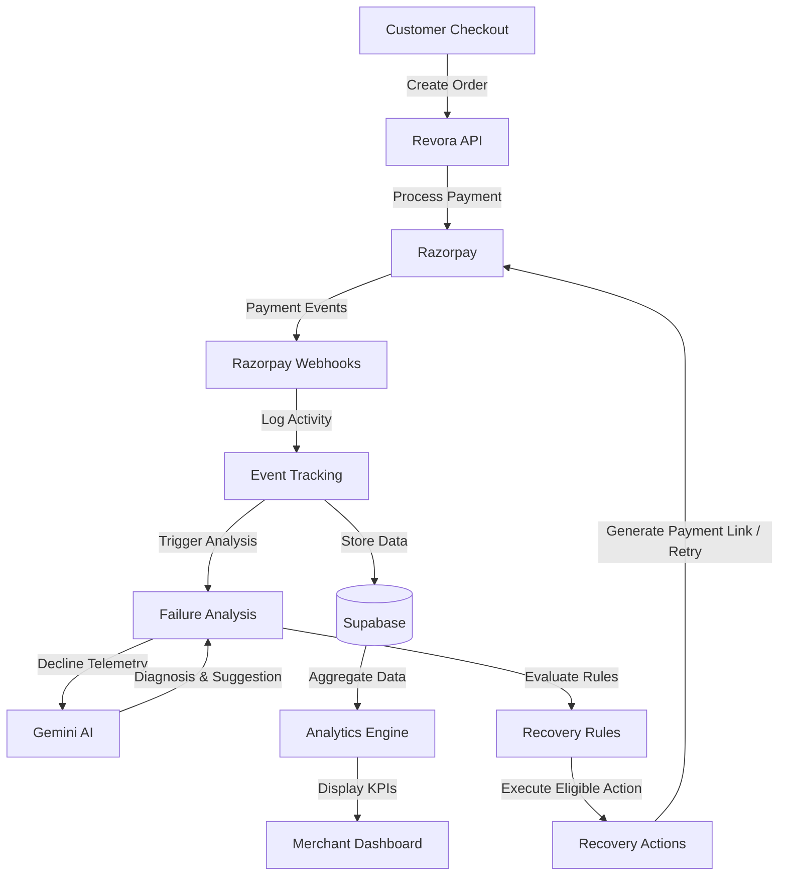
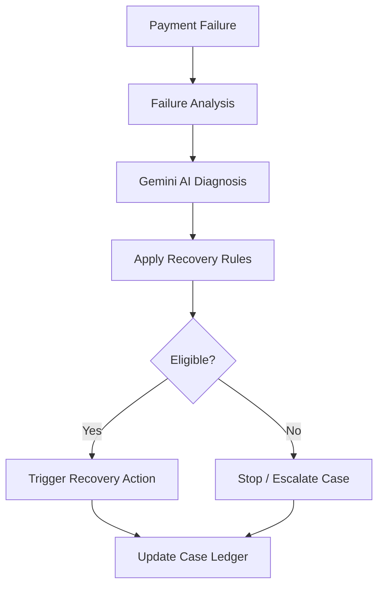
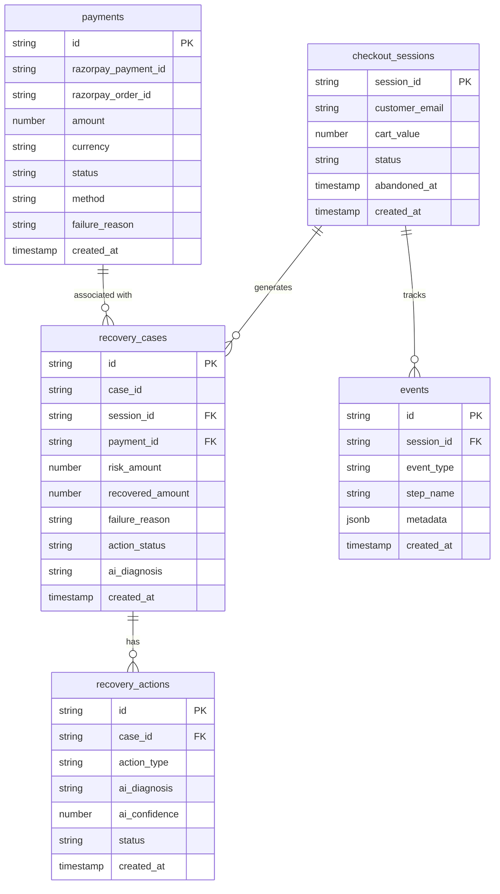

# Revora — AI Revenue Recovery Agent

Developed for **Razorpay Buildathon 2026 — Track 03: AI Revenue Recovery**

Revora detects payment failures, analyzes the failure reason, checks recovery rules, and starts a recovery action when the payment is eligible.

---

## Overview

When an online payment fails, businesses lose revenue and risk losing the customer entirely. Most checkout integrations treat a failed payment as a dead end—displaying a generic error message and relying on the customer to try again.

Revora is a server-side revenue recovery system built on Next.js, Supabase, and Razorpay. It tracks checkout inactivity and payment failures, uses Google Gemini to analyze gateway failure telemetry, applies safety rules before taking action, and tracks recovered revenue in a merchant dashboard.

---

## Problem

Payment failures occur for many reasons: temporary issuing bank outages, insufficient funds, card limit breaches, network timeouts, or customer hesitation during checkout.

Treating every failure identically creates two issues:
1. **Lost Revenue**: High-intent customers leave without completing their purchase if no alternate recovery path is provided.
2. **Poor Experience & Risk**: Repeatedly retrying a permanently declined card creates customer friction and can trigger gateway fraud flags.

Revora treats payment failures as a decision problem: determining why the transaction failed and choosing an appropriate action.

---

## Solution

Revora adds an automated decision and recovery pipeline to the payment process:

1. **Detection**: Captures payment failures via Razorpay webhooks and tracks checkout abandonment through funnel events.
2. **Analysis**: Passes structured decline codes and session metadata to Gemini AI for root-cause diagnosis.
3. **Rules Check**: Verifies fixed application rules (e.g. status is UNPAID, retry count < 3, 15-minute cooldown between retries) before allowing any action.
4. **Action**: Dispatches an appropriate recovery method such as a 1-click Razorpay payment link, an alternate payment method suggestion, or a customer reminder.
5. **Ledger & Audit**: Stores all events, diagnoses, and payment reconciliations in Supabase for tracking and analytics.

---

## Architecture



### Architecture Breakdown

1. A customer starts checkout on the storefront.
2. Revora creates and verifies the Razorpay order server-side.
3. Razorpay sends payment events (e.g., `payment.failed`, `payment.captured`) through webhooks.
4. Revora stores relevant events and payment/session information in Supabase.
5. Failed payments are analyzed using Gemini.
6. Revora applies fixed recovery rules before taking action.
7. Eligible cases are sent to the recovery action logic (such as generating a Razorpay Payment Link).
8. Recovery activity is stored for tracking and analytics.
9. Merchant-facing analytics are displayed in the dashboard.

---

## Recovery Flow & Policy Rules



### How Decisioning Works

Gemini analyzes the failure telemetry (error code, error source, payment method, cart value) to provide a diagnosis and confidence score. However, **the AI model does not have permission to execute actions directly**.

Fixed application logic evaluates the case against explicit recovery rules:

* **Payment Status**: Case must be currently `UNPAID` or `ABANDONED` (no action if already `COMPLETED_CAPTURED`).
* **Retry Count**: Total recovery attempts must be less than 3.
* **Cooldown Window**: Minimum 15-minute cooldown between repeated automated attempts.
* **Hard Stop Criteria**: Permanent card blocks or invalid credentials halt recovery immediately.

If all checks pass, the system dispatches the recommended action (such as generating a 1-click Razorpay Payment Link).

---

## Database Structure

Revora uses Supabase (PostgreSQL) with 5 primary tables:



---

## Tech Stack

- **Framework**: [Next.js 16 (App Router)](https://nextjs.org/)
- **Language**: [TypeScript](https://www.typescriptlang.org/)
- **Styling**: [Tailwind CSS v4](https://tailwindcss.com/)
- **Payment Gateway**: [Razorpay Node SDK (`razorpay`)](https://razorpay.com/)
- **AI Diagnosis**: [Google Gemini AI (`@google/genai`)](https://ai.google.dev/)
- **Database**: [Supabase (`@supabase/supabase-js`)](https://supabase.com/)
- **Visuals**: Three.js & HTML5 Video Engine

---

## Project Structure

```
revora/
├── app/
│   ├── page.tsx                    # Landing Page
│   ├── store/                      # Customer Storefront
│   ├── cart/                       # Cart Page
│   ├── checkout/                   # Checkout & Payment Modal
│   ├── merchant/                   # Merchant Portal Routes
│   │   ├── page.tsx                # Executive Dashboard
│   │   ├── payments/               # Payment Failures Engine
│   │   ├── abandonments/           # Abandonment Recovery Engine
│   │   ├── analytics/              # Revenue Analytics
│   │   └── sandbox/                # Payment Simulator
│   └── api/                        # API Routes
│       ├── razorpay/               # Create Order & Verify Payment
│       ├── webhooks/razorpay/      # Webhook Listener (failed/captured)
│       ├── events/                 # Funnel Tracking & Abandonment Eval
│       └── recovery/               # Cases, AI Analysis, Actions & Metrics
├── components/                     # Shared UI Components & Layouts
├── lib/                            # Supabase Client & Server Auth Helpers
└── public/                         # Static Assets & Engine Videos
```

---

## Setup & Installation

### Prerequisites
- Node.js `>=20.0.0`
- Razorpay Account (Test Mode Key ID & Secret)
- Supabase Project (URL, Anon Key, Service Role Key)
- Google Gemini API Key

### Local Setup

1. **Clone the repository**:
   ```bash
   git clone https://github.com/NagaTejaSriCore/Revora.git
   cd Revora
   ```

2. **Install dependencies**:
   ```bash
   npm install
   ```

3. **Configure Environment Variables**:
   Create `.env.local` in the project root:
   ```env
   NEXT_PUBLIC_APP_URL=http://localhost:3000

   # Supabase
   NEXT_PUBLIC_SUPABASE_URL=https://your-project.supabase.co
   NEXT_PUBLIC_SUPABASE_ANON_KEY=your-anon-key
   SUPABASE_SERVICE_ROLE_KEY=your-service-role-key

   # Razorpay (Test Mode)
   RAZORPAY_KEY_ID=rzp_test_your_key_id
   RAZORPAY_KEY_SECRET=your_key_secret

   # Gemini AI
   GEMINI_API_KEY=your-gemini-api-key
   ```

4. **Run Development Server**:
   ```bash
   npm run dev
   ```
   Navigate to [http://localhost:3000](http://localhost:3000).

5. **Build for Production**:
   ```bash
   npx tsc --noEmit
   npm run build
   ```

---

## API & Webhook Endpoints

- `POST /api/razorpay/create-order` — Creates Razorpay orders (standard checkout, recovery links, cart session recovery).
- `POST /api/razorpay/verify-payment` — Verifies HMAC payment signatures and records captured payments in Supabase.
- `POST /api/webhooks/razorpay` — Webhook handler processing `payment.failed` and `payment.captured` gateway events.
- `POST /api/events/track` — Logs funnel interaction events (cart steps, checkout activity).
- `POST /api/events/abandonment/eval` — Evaluates checkout sessions for inactivity and flags abandonments.
- `POST /api/recovery/analyze` — Sends decline code telemetry to Gemini AI for root-cause diagnosis.
- `POST /api/recovery/action` — Validates recovery rules and generates Razorpay payment links or retries.
- `GET /api/recovery/metrics` — Unified metric engine returning total abandonments, open cases, and recovered revenue.

---

## Implemented Features vs. Future Roadmap

### Implemented & Verified
- Complete Storefront, Cart, and Razorpay Test Mode Checkout flow.
- Webhook listener for `payment.failed` and `payment.captured` events.
- Inactivity tracking and abandonment detection.
- Gemini AI root-cause diagnosis for gateway decline payloads.
- Bounded recovery action dispatcher (generating 1-click Razorpay Payment Links).
- Merchant Portal with separate sections for Dashboard, Payment Failures, Abandonments, Analytics, and Sandbox.

### Future Roadmap
- Automated WhatsApp & SMS notification delivery for recovery payment links.
- Merchant UI for customizing retry counts and cooldown windows per product tier.
- Multi-gateway fallback routing for extended issuing bank outages.

---

*Built for **Razorpay Buildathon 2026**.*
