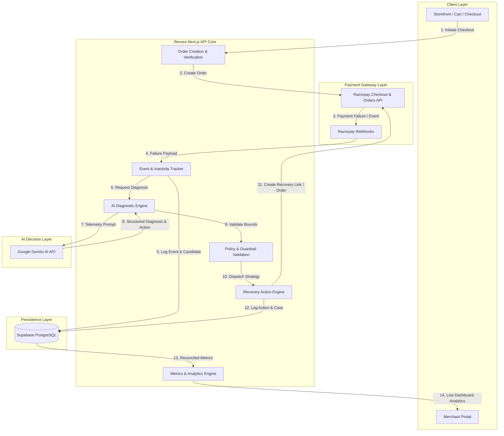

# Revora — AI Revenue Recovery Agent

Built for **Razorpay Buildathon 2026 — Track 03: AI Revenue Recovery**

> **Revora** is an AI-powered revenue recovery system that detects failed payments, determines why revenue is at risk, chooses a bounded recovery strategy, and records the outcome with an auditable trail.

---

## 1. Problem

When a payment fails during online checkout, the problem is not simply "payment failed." 

A failed payment represents **revenue at risk**.

In traditional e-commerce setups, payment declines and cart abandonments are treated as terminal events. Businesses are left guessing:
- Why did the payment actually fail? Was it a temporary bank outage, insufficient funds, or an authorization lock?
- Is the failure temporary or persistent?
- Should the customer retry immediately, or should they be offered an alternate payment method?
- Should the system wait before attempting an automated background retry?
- When should recovery attempts stop to avoid customer fatigue or chargeback risks?
- When should a high-value case be escalated to merchant support?
- How much revenue was actually recovered versus lost permanently?

Repeatedly retrying every failed payment blindly is **not intelligent recovery**. It creates poor customer experiences, increases gateway decline fees, and risks account flags. 

**Revora treats payment failure as a revenue recovery decision problem.**

---

## 2. Solution

Revora introduces an autonomous decisioning and execution pipeline that transforms payment failures and checkout abandonments into captured sales:

```
Razorpay Payment Failure / Abandonment
                 ↓
      Revenue at Risk Detected
                 ↓
    Failure Information Analyzed
                 ↓
          AI Diagnosis
                 ↓
   Recovery Strategy Selected
                 ↓
      Bounded Recovery Action
                 ↓
      Recovery Outcome Recorded
                 ↓
           Audit Trail
```

Instead of displaying a generic error message and walking away, Revora interceptively analyzes gateway decline codes, customer behavioral signals, and order context. It passes structured diagnostic metadata to Google Gemini AI to select a bounded, policy-guarded recovery action (e.g., smart retry, 1-click recovery link, alternate payment routing, or customer notification), executes the action, and logs every step in an auditable database ledger.

The goal is not merely to classify failures, but to **make a useful business decision about what should happen next**.

---

## 3. Why Revora?

| Feature | Traditional Payment Gateway / Dashboard | Revora Revenue Intelligence Agent |
| :--- | :--- | :--- |
| **Failure Handling** | Displays "Payment Failed" status and stops. | Intercepts failure as an active revenue recovery candidate. |
| **Root Cause Analysis** | Raw gateway error codes (`BAD_REQUEST`, `AUTHORIZATION_FAILED`). | Gemini AI contextual diagnosis with confidence scoring. |
| **Recovery Strategy** | Manual merchant follow-up or blind retries. | Autonomous strategy selection (Smart Retry, 1-Click Link, Escalation). |
| **Abandonment Tracking** | Passive Google Analytics funnel drop-off stats. | Real-time funnel event tracking + dynamic recovery payment links. |
| **Action Boundaries** | Uncontrolled manual retries or zero action. | Strict guardrails (cooldowns, max retry caps, stopping rules). |
| **Auditability** | Disjointed gateway logs and order databases. | End-to-end recovery lifecycle audit trail in Supabase. |
| **Revenue Focus** | Tracks total volume processed. | Measures Net Reclaimed Revenue and Recovery Conversion Rates. |

### Core Pillars
- **Revenue-First Thinking**: Evaluates every failure by its monetary value at risk (`cart_value`).
- **AI-Assisted Decision Making**: Leverages Gemini AI to interpret complex decline telemetry into actionable strategies.
- **Bounded Actions & Stopping Rules**: Enforces strict execution bounds so actions stop when recovery is no longer sensible.
- **Auditability & Traceability**: Every decision, prompt, diagnostic score, and captured payment is logged in Supabase.
- **Seamless Razorpay Integration**: Native integration with Razorpay Test Mode Checkout, Webhooks, and Orders API.

---

## 4. Core Workflow

Revora operates an 8-stage recovery pipeline:

```
┌─────────────────┐     ┌──────────────────┐     ┌──────────────────┐     ┌──────────────────┐
│ 1. Payment      │ ──> │ 2. Failure       │ ──> │ 3. Revenue       │ ──> │ 4. AI            │
│    Creation     │     │    Detection     │     │    at Risk       │     │    Diagnosis     │
└─────────────────┘     └──────────────────┘     └──────────────────┘     └──────────────────┘
                                                                                   │
┌─────────────────┐     ┌──────────────────┐     ┌──────────────────┐              │
│ 8. Audit        │ <── │ 7. Outcome       │ <── │ 6. Recovery      │ <── ┌─────────┴────────┐
│    Trail        │     │    Recorded      │     │    Execution     │     │ 5. Recovery      │
└─────────────────┘     └──────────────────┘     └──────────────────┘     │    Decision      │
                                                                          └──────────────────┘
```

### Step 1 — Payment Creation
Revora creates Razorpay orders via a secure server-side Next.js route (`/api/razorpay/create-order`). The Razorpay API secret remains strictly server-side.

### Step 2 — Failure Detection
When a transaction fails or a customer halts interaction during checkout, Revora detects the candidate. Structured Razorpay failure payloads include:
- `error_code`, `error_description`, `error_source`, `error_step`, `error_reason`
- `payment_method` (UPI, Card, Netbanking, Wallet)
- `amount`, `order_id`, `payment_id`

### Step 3 — Revenue at Risk
Revora calculates `risk_amount`, representing the exact monetary value of the order (`cart_value`). This ensures high-value transactions receive priority recovery strategies.

### Step 4 — AI Diagnosis
Structured payment failure information is evaluated by Gemini AI. The AI does not invent facts; it acts as a decision-support layer over authoritative gateway telemetry.

*Example:*
- **Input**: `method: card`, `reason: issuer_bank_unavailable`, `amount: ₹12,999`
- **Gemini AI Diagnosis**: `"Temporary issuing bank network disruption detected. High recovery likelihood via alternate payment method or delayed retry."` (Confidence: 95%)

### Step 5 — Recovery Decision
The system selects an optimal, bounded recovery action:
- `smart_retry`: Schedule background retry during bank window recovery.
- `payment_link`: Generate a 1-click personalized Razorpay recovery payment link.
- `alternative_method`: Recommend switching from Card to UPI / Netbanking.
- `customer_notification`: Dispatch automated email/SMS recovery link.
- `escalate`: Mark for manual merchant review (high value, repeated decline).
- `stop`: Terminate recovery attempts when fraud or permanent card block is detected.

### Step 6 — Recovery Execution
The recovery engine dispatches the selected action (e.g., creating a dedicated recovery order in Razorpay or generating a direct checkout URL).

### Step 7 — Outcome Recorded
When the customer completes payment via the recovery link or background retry, Razorpay webhooks (`payment.captured`) or client verification routes (`/api/razorpay/verify-payment`) update the database.

### Step 8 — Audit Trail
Every stage is persisted in Supabase tables (`recovery_cases`, `recovery_actions`, `events`), establishing a transparent audit trail from failure detection to revenue capture.

---

## 5. AI Decisioning Philosophy & Safety Guardrails

Revora adheres to a strict safety-first AI engineering principle:

> **AI decides WHAT SHOULD HAPPEN.**  
> **Rules and application logic decide WHAT IS ALLOWED TO HAPPEN.**

An LLM is never given unrestricted access to execute financial transactions. Instead, Gemini AI outputs structured recommendations that are validated against deterministic guardrails before execution:

```
                     ┌──────────────────────────────┐
                     │   Structured Failure Event   │
                     └──────────────┬───────────────┘
                                    │
                                    ▼
                     ┌──────────────────────────────┐
                     │      Gemini AI Diagnosis     │
                     └──────────────┬───────────────┘
                                    │
                                    ▼
                     ┌──────────────────────────────┐
                     │  Deterministic Guardrails    │
                     │  - Max retries: 3            │
                     │  - Cooldown: 15 mins         │
                     │  - Status check: UNPAID      │
                     └──────────────┬───────────────┘
                                    │
                         ┌──────────┴──────────┐
                         │ Allowed?            │
                         └─────┬─────────┬─────┘
                            Yes│         │No
                               ▼         ▼
                    ┌────────────┐   ┌────────────┐
                    │  Execute   │   │  Halt /    │
                    │  Recovery  │   │  Escalate  │
                    └────────────┘   └────────────┘
```

### Safety Guardrails Enforced:
1. **No Duplicate Actions**: If a session has already been recovered (`COMPLETED_CAPTURED`), recovery triggers are disabled.
2. **Maximum Retry Caps**: Limits automated background retries to a maximum of 3 attempts per transaction.
3. **Mandatory Cooldowns**: Enforces a minimum 15-minute wait window between automated retries.
4. **Hard Stopping Rules**: Halts recovery immediately upon detecting invalid card numbers, stolen card flags, or explicit customer cancellation.
5. **Full Ledger Logging**: Every AI prompt input, raw response, confidence score, and policy check is logged for auditability.

---

## 6. Architecture



### Architectural Components
1. **Next.js 16 App Router Core**: Serverless API routes handling order generation, payment verification, event tracking, and analytics aggregation.
2. **Razorpay Node SDK Integration**: Server-side client utilizing `RAZORPAY_KEY_ID` and `RAZORPAY_KEY_SECRET` for secure order creation and webhook verification.
3. **Google Gemini AI SDK (`@google/genai`)**: Diagnostic engine analyzing gateway decline payloads and customer funnel inactivity.
4. **Supabase PostgreSQL Database**: Central data layer storing payments, checkout sessions, recovery cases, actions, and event timelines.
5. **Merchant Portal Frontend**: Dedicated management interface organized into Dashboard (`/merchant`), Payment Failures (`/merchant/payments`), Abandonments (`/merchant/abandonments`), Analytics (`/merchant/analytics`), and Sandbox (`/merchant/sandbox`).

---

## 7. Database & Data Model

Revora utilizes Supabase (PostgreSQL) with 5 core tables:

```
  ┌───────────────────┐         ┌───────────────────┐
  │ checkout_sessions │         │     payments      │
  ├───────────────────┤         ├───────────────────┤
  │ session_id (PK)   │         │ id (PK)           │
  │ customer_email    │         │ payment_id        │
  │ cart_value        │         │ order_id          │
  │ status            │         │ amount            │
  │ abandoned_at      │         │ status            │
  └─────────┬─────────┘         └─────────┬─────────┘
            │                             │
            └──────────────┬──────────────┘
                           │
                           ▼
                  ┌─────────────────┐
                  │  recovery_cases │
                  ├─────────────────┤
                  │ id (PK)         │
                  │ case_id         │
                  │ session_id (FK) │
                  │ payment_id (FK) │
                  │ risk_amount     │
                  │ failure_reason  │
                  │ status          │
                  └────────┬────────┘
                           │
             ┌─────────────┴─────────────┐
             ▼                           ▼
  ┌────────────────────┐      ┌────────────────────┐
  │  recovery_actions  │      │       events       │
  ├────────────────────┤      ├────────────────────┤
  │ id (PK)            │      │ id (PK)            │
  │ case_id (FK)       │      │ session_id (FK)    │
  │ action_type        │      │ event_type         │
  │ ai_diagnosis       │      │ step_name          │
  │ ai_confidence      │      │ metadata           │
  │ status             │      │ created_at         │
  └────────────────────┘      └────────────────────┘
```

---

## 8. Implemented vs. Planned Functionality

### Currently Implemented (Production Ready)
- [x] **Storefront & Checkout Integration**: Product catalog (`/store`), Cart (`/cart`), and Checkout (`/checkout`) with Razorpay Test Mode modal integration.
- [x] **Razorpay Order & Payment APIs**: Server-side order creation (`/api/razorpay/create-order`) and HMAC signature verification (`/api/razorpay/verify-payment`).
- [x] **Razorpay Webhooks Listener**: Webhook route (`/api/webhooks/razorpay`) handling `payment.failed` and `payment.captured` events.
- [x] **Real-Time Funnel Event Tracking**: Funnel tracker (`/api/events/track`) monitoring checkout steps, cart modifications, and contact form entries.
- [x] **Checkout Abandonment Detection**: Inactivity evaluator (`/api/events/abandonment/eval`) flagging uncompleted checkout sessions as `ABANDONED`.
- [x] **Gemini AI Failure Diagnosis Engine**: AI diagnostic endpoints (`/api/recovery/analyze` & `/api/recovery/abandonment-analyze`) returning root cause, confidence score, and recommended recovery strategy.
- [x] **Bounded Recovery Action Dispatcher**: Action engines (`/api/recovery/action` & `/api/recovery/abandonment-action`) executing smart retries and 1-click recovery payment links.
- [x] **Unified Recovery Analytics**: Analytics engines (`/api/recovery/metrics`, `/api/recovery/analytics`, `/api/recovery/performance`) calculating cumulative detected abandonments (10), open abandonments (8), recovered revenue (₹5,25,998), and failure category breakdowns.
- [x] **Reorganized Merchant Portal**: Dedicated routes for Executive Dashboard (`/merchant`), Payment Failure Engine (`/merchant/payments`), Abandonment Engine (`/merchant/abandonments`), Analytics (`/merchant/analytics`), and Payment Simulator (`/merchant/sandbox`).

### Planned Next-Stage Features
- [ ] **Multi-Channel SMS/WhatsApp Gateway**: Automated WhatsApp Template messages containing 1-click recovery links dispatched via Twilio / Gupshup.
- [ ] **Custom Merchant Policy Builder**: Interface enabling merchants to define custom max-retry caps and risk thresholds per product category.
- [ ] **Multi-Gateway Routing**: Dynamic failover routing across secondary payment gateways (e.g. PayU, Cashfree) when Razorpay issuing bank outages occur.

---

## 9. Technology Stack

- **Framework**: [Next.js 16 (App Router)](https://nextjs.org/)
- **Language**: [TypeScript](https://www.typescriptlang.org/)
- **Styling**: [Tailwind CSS v4](https://tailwindcss.com/)
- **Payment Gateway**: [Razorpay Node SDK (`razorpay`)](https://razorpay.com/)
- **AI / LLM Engine**: [Google Gemini AI (`@google/genai`)](https://ai.google.dev/)
- **Database & Auth**: [Supabase (`@supabase/supabase-js`)](https://supabase.com/)
- **Visuals & 3D**: [Three.js](https://threejs.org/) & HTML5 Video Engine
- **Icons**: Heroicons & Custom SVG Graphics

---

## 10. Getting Started & Installation Guide

### Prerequisites
- Node.js `^18.17.0` or `>=20.0.0`
- npm `^9.0.0` or yarn / pnpm
- Razorpay Test Mode Account (Key ID & Key Secret)
- Supabase Project (URL, Anon Key, Service Role Key)
- Google Gemini API Key

### Local Installation

1. **Clone the repository**:
   ```bash
   git clone https://github.com/NagaTejaSriCore/Revora.git
   cd Revora
   ```

2. **Install dependencies**:
   ```bash
   npm install
   ```

3. **Configure Environment Variables**:
   Create a `.env.local` file in the project root:
   ```env
   # App Configuration
   NEXT_PUBLIC_APP_URL=http://localhost:3000

   # Supabase Credentials
   NEXT_PUBLIC_SUPABASE_URL=https://your-supabase-project.supabase.co
   NEXT_PUBLIC_SUPABASE_ANON_KEY=your-supabase-anon-key
   SUPABASE_SERVICE_ROLE_KEY=your-supabase-service-role-key

   # Razorpay Test Mode Credentials
   RAZORPAY_KEY_ID=rzp_test_your_key_id
   RAZORPAY_KEY_SECRET=your_razorpay_key_secret

   # Google Gemini AI API Key
   GEMINI_API_KEY=your-google-gemini-api-key
   ```

4. **Run Development Server**:
   ```bash
   npm run dev
   ```
   Open [http://localhost:3000](http://localhost:3000) in your browser.

5. **Production Build & Verification**:
   ```bash
   npx tsc --noEmit
   npm run build
   npm start
   ```

---

### Key Application Routes

- **Brand Landing Page**: `/`
- **Customer Storefront**: `/store`
- **Customer Cart & Checkout**: `/cart` & `/checkout`
- **Merchant Executive Dashboard**: `/merchant`
- **Payment Failure Recovery Engine**: `/merchant/payments`
- **Checkout Abandonment Recovery**: `/merchant/abandonments`
- **Revenue Analytics & Intelligence**: `/merchant/analytics`
- **Razorpay Payment Simulator**: `/merchant/sandbox`
- **Supabase Connection Verification**: `GET /api/test-supabase`
- **Razorpay Order Creation Endpoint**: `POST /api/razorpay/create-order`

---

*Built with ❤️ for **Razorpay Buildathon 2026**.*
